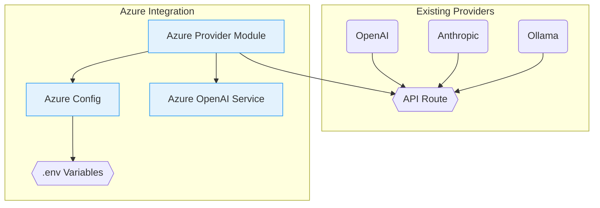

# Azure OpenAI Integration Architecture



## Key Components

1. **Azure Provider Module** (`src/lib/providers/azureOpenAI.ts`)
   - Handles Azure-specific configuration
   - Implements model loading for Azure deployments
   - Extends base provider interface

2. **Configuration Flow**
   ```mermaid
   sequenceDiagram
       User->>Environment: Set AZURE_OPENAI_* vars
       AzureProvider->>Config: Validate credentials
       Config->>AzureProvider: Return configuration
       AzureProvider->>Langchain: Initialize client
       Langchain->>Azure API: Make requests
   ```

3. **Environment Variables
   - `AZURE_OPENAI_API_KEY`
   - `AZURE_OPENAI_API_INSTANCE_NAME`
   - `AZURE_OPENAI_CHAT_DEPLOYMENT_NAME`
   - `AZURE_OPENAI_EMBEDDING_DEPLOYMENT_NAME`

4. **Architecture Principles
   - Complete isolation from standard OpenAI implementation
   - Shared provider interface contract
   - Separate error handling boundaries